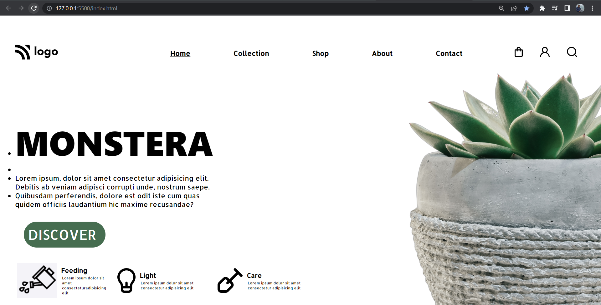

# Hi, I'm Venkatesh Koppar

## Concepts Learnt In this project:

1. Inline CSS
2. Positions

## Experience gained from this project:
I was able to apply css styles by using Internal style sheet. 
Was able to use concepts of css like selectors which are used to target a particular class or a element. Got handson experience on using properties like margins, padding,borders etc.   

## Time taken to complete this project:
3 hrs

## Application Link
https://plant-home-web-page.netlify.app/

### Techonology used:
1. HTML
2. CSS

### Softwares used:

